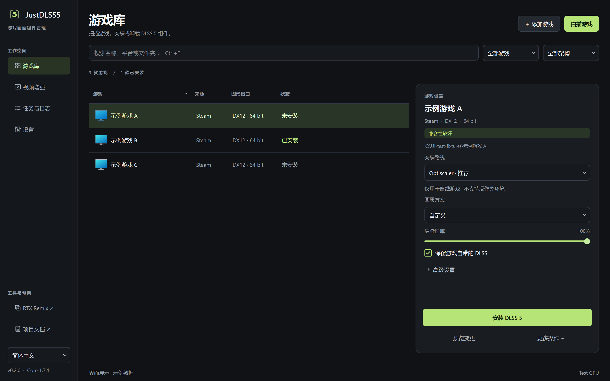
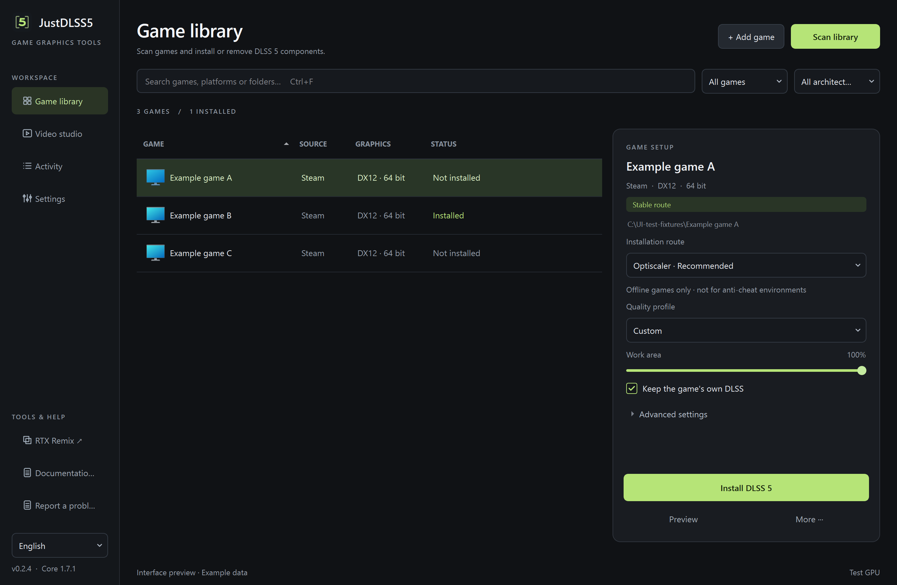

<p align="center">
  
</p>

<h1 align="center">JustDLSS5</h1>

<p align="center"><strong>DLSS 5，少一点折腾。</strong></p>

<p align="center">
  Windows 桌面工具，用于扫描游戏、安装画面组件，<br>
  以及管理 DLSS 5 相关配置。基于 Qt（PySide），界面支持简体中文与英文。
</p>

<p align="center">
  <strong>v0.2.4 · 玩家测试版</strong> · 安装核心为 DLSS5-Autopilot <strong>v1.7.1</strong>
</p>

<p align="center">
  <a href="./README.md">English</a> ·
  <a href="#下载">下载</a> ·
  <a href="#功能">功能</a> ·
  <a href="#使用注意">注意</a> ·
  <a href="#致谢与许可">许可</a>
</p>

<p align="center">
  
  
  
  
  
</p>

---

## 下载

请从 [Releases](https://github.com/ha7rock/JustDLSS5/releases) 下载 Windows x64 包：`JustDLSS5-v0.2.4-windows-x64.zip`。

1. 将压缩包完整解压到可写目录。
2. 运行 `JustDLSS5.exe`。请保留同目录下的 `_internal` 文件夹及许可文件，勿仅复制单个 EXE。
3. 便携版无需另行安装 Python。
4. 如需校验完整性，可对照 `SHA256SUMS.txt`。PowerShell 示例：`Get-FileHash <文件> -Algorithm SHA256`。

同版本还提供：`BUILD-INFO.json`（构建信息）、`JustDLSS5-v0.2.4-source-materials.zip`（应用及对应依赖源码）。

测试说明：[docs/TESTING-PREVIEW.zh-CN.md](docs/TESTING-PREVIEW.zh-CN.md)。问题反馈：[提交 Issue](https://github.com/ha7rock/JustDLSS5/issues/new?template=bug-report.yml)，或使用应用内「反馈问题」。

> 本版本为社区玩家测试版，并非稳定版，亦与 NVIDIA 无关。

---

## 截图

| 中文界面 | 英文界面 |
| --- | --- |
|  |  |

*截图中的游戏数据为示意内容，非真实库存。*

---

## 项目简介

自行配置 DLSS 5 相关组件时，往往需要查找安装包、核对图形接口并修改路径，步骤繁琐且容易出错。上游项目 [DLSS5-Autopilot](https://github.com/Kizzuwatnaa/DLSS5-Autopilot) 已实现安装流程；JustDLSS5 在此基础上提供独立桌面界面，便于扫描游戏库、选择方案、预览变更，以及完成卸载与还原。

| | 手动配置 | DLSS5-Autopilot | **JustDLSS5** |
|---|---|---|---|
| 界面 | 无 | 上游工具 | 独立 Qt（PySide）桌面应用 |
| 语言 | — | 上游 | 简体中文 / 英文 |
| 游戏库 | 手动整理 | 上游流程 | 扫描本机、添加目录、查看安装状态 |
| 安装核心 | 自行处理 | 上游 | 当前为 Autopilot **v1.7.1**（`core/`） |
| 维护 | 手动 | 上游 | 预览、诊断、卸载、备份还原 |
| 分发 | — | 上游 | 测试版 ZIP、校验摘要、许可与源码包 |

---

## 功能

**安装与游戏库**
- 检测游戏环境并提供安装方案
- 下载并配置组件；安装前可预览变更
- 扫描本机游戏，或手动添加目录；查看安装状态

**配置与维护**
- 调整参数，保存并载入配置
- 诊断问题；支持卸载与从备份还原

**按游戏设置**
- 可手动选择图形 API，并按游戏保留
- 在适用条件下提供 FSR 补帧、RTX 40 MFG 相关选项

**界面与反馈**
- 简体中文 / 英文界面，窗口可缩放
- 后台任务会在对应操作按钮上显示进度
- 应用内可提交反馈（自动填入版本与当前游戏）
- 检查更新仅打开发布页，**不会**自动覆盖程序

**其他**
- 屏幕 / 窗口捕获（与摄像头共用开始与停止）
- 视频增强与 RTX Remix 相关工具

**安全提示**
- 涉及反作弊的游戏，在安装或批量重装前需要确认（默认取消）
- 未出现警告，并不表示该游戏允许安装插件

---

## 与 DLSS5-Autopilot 的区别

| | DLSS5-Autopilot | JustDLSS5 |
|---|---|---|
| 定位 | 上游安装引擎 / 工具 | 基于该逻辑的桌面界面 |
| 版本 | 随上游发布 | 当前为 **v1.7.1**（见 `backend-version.json`） |
| 界面 | 上游 | 独立 Qt 应用，中英双语 |
| 发行包 | 上游项目 | 便携 ZIP、SHA-256、构建信息、许可与源码 |
| 许可 | 上游 | JustDLSS5 代码采用 MIT；保留上游版权 |

安装相关代码位于 `core/`。详见 [上游与来源](docs/UPSTREAM-AND-SOURCES.zh-CN.md)、[上游 README](docs/UPSTREAM_README.md)。本测试版**不包含**上游 v1.7.2 的新增内容。

---

## 使用注意

- 已覆盖界面、衔接、命令行与打包启动的自动检查。**不提供「已验证兼容游戏」名单**；未单独说明的组合，均视为未验证。
- 建议优先使用**离线单机**游戏进行测试。安装前请自行备份存档与重要配置。本工具的组件备份不能替代完整备份。
- 反作弊检测并不完整；**没有警告不等于可以安全安装**。请勿使用联网或反作弊游戏进行试探。
- 组件需从第三方站点下载。下载失败不一定代表游戏不兼容，请保留任务日志。
- 程序尚未进行商业代码签名。SHA-256 仅用于确认文件完整，不代表安全认证。
- 测试版仍可能存在问题。如遇异常，请附可复现步骤反馈。

详细说明见：[玩家测试说明](docs/TESTING-PREVIEW.zh-CN.md)。

**显卡说明**（整理自 `docs/` 中的上游 / 社区资料，并非本项目实测帧数）
- 上游工具对 RTX 50 / 40 / 20–30 提供相应路径
- GTX 及 RTX 20 以下显卡无法运行
- 相关生态仍在变化，本文不承诺具体性能提升

---

## 从源码构建

适用于开发与贡献（Windows x64、Python 3.12）：

```bat
python -m venv .venv
.venv\Scripts\activate
pip install -r requirements-desktop.txt
python autopilot_desktop.py
```

```bat
build-desktop.bat
```

输出路径：`dist/v0.2.4/JustDLSS5/JustDLSS5.exe`。请保留同目录下的 `_internal`。

维护说明：[docs/MAINTAINING.zh-CN.md](docs/MAINTAINING.zh-CN.md)。

---

## 致谢与许可

**致谢**
- 安装核心：[Kizzuwatnaa/DLSS5-Autopilot](https://github.com/Kizzuwatnaa/DLSS5-Autopilot)
- 项目还可能使用 ReShade、RenoDX、Feeder、OptiScaler、DXVK、RTX Remix 等组件。详见 [第三方声明](docs/THIRD-PARTY-NOTICES.md)、[上游与来源](docs/UPSTREAM-AND-SOURCES.zh-CN.md)

**许可**
- JustDLSS5 项目代码：**MIT**
- 源自 Autopilot 的部分请保留上游版权
- 第三方组件、NVIDIA 运行时与游戏 mod 适用各自许可。源码仓库不包含这些二进制；便携发行包另附依赖许可说明

---

## 文档

- [玩家测试说明](docs/TESTING-PREVIEW.zh-CN.md)
- [v0.2.4 说明](docs/RELEASE-v0.2.4.md)
- [第三方声明](docs/THIRD-PARTY-NOTICES.md)
- [维护说明](docs/MAINTAINING.zh-CN.md)
- [上游与来源](docs/UPSTREAM-AND-SOURCES.zh-CN.md) · [上游 README](docs/UPSTREAM_README.md)

---

<p align="center">JustDLSS5 · v0.2.4 玩家测试版 · MIT · 社区工具，与 NVIDIA 无关</p>
